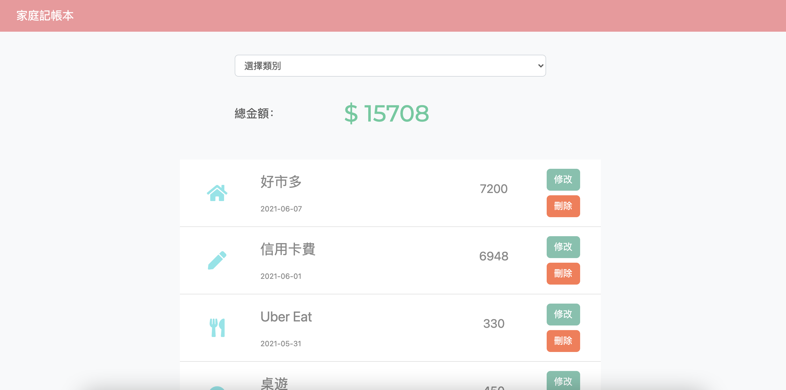
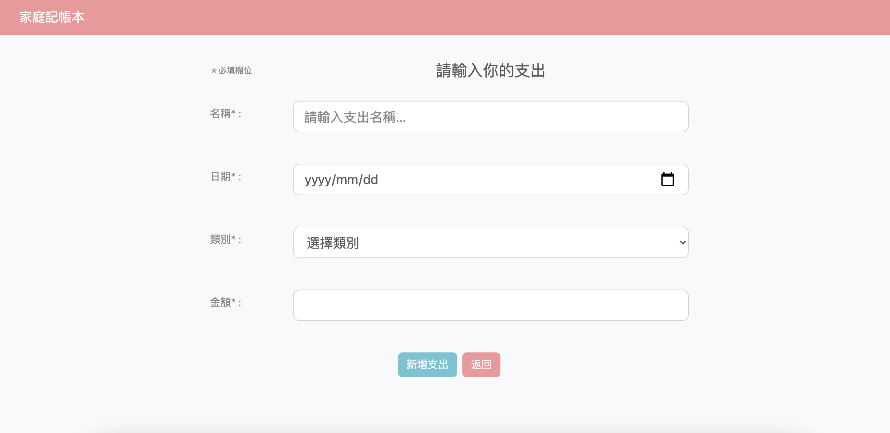
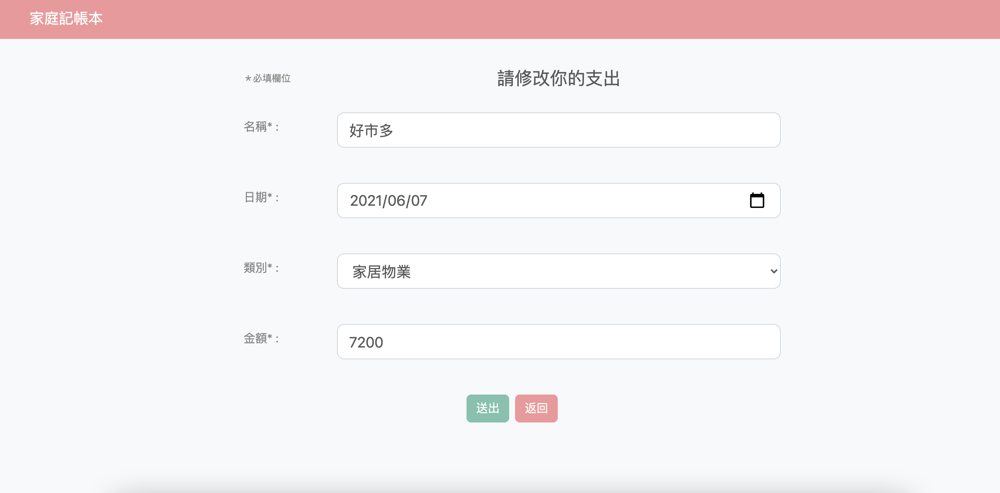
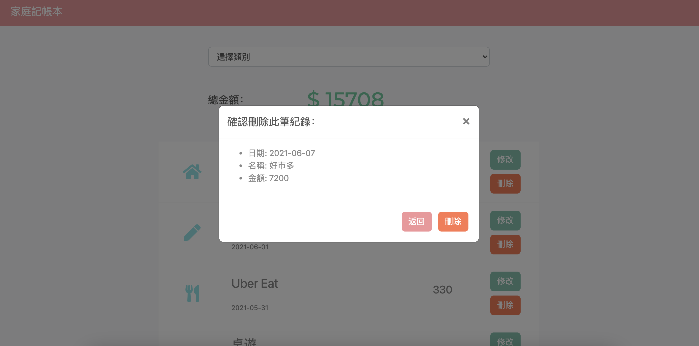

## 家庭記帳本
簡易的家庭收支記帳本

[Heroku 家庭記帳本](https://morning-taiga-72111.herokuapp.com/)

## 功能
* 使用者可以在首頁瀏覽所有支出的清單
* 使用者可以在首頁看到所有支出清單的總金額
* 使用者可以新增一筆支出
* 使用者可以編輯支出的所有屬性，包含
  * 名稱
  * 日期
  * 類別
  * 金額
* 使用者一次可刪除任何一筆支出，刪除時會跳出確認刪除視窗
* 在首頁可以根據支出「類別」篩選支出；總金額的計算只會包括被篩選出來的支出總和

### 首頁


### 新增支出


### 修改支出


### 刪除支出


## Getting Started
**Clone respository**
```
$ git clone https://github.com/jilltu330/expense-tracker.git
```
**Install by npm**
```
$ npm install
```
**DB Seed**
```
$ npm run seed
```
**Execute**
```
$ npm run dev
```
**Browse the website on localhost**
```
http://localhost:3000/
```

## Built With
* Node.js (v10.15.0)
* Express (v4.17.1)
* Express-Handlebars (v5.3.2)
* Bootstrap (v4.3.1)
* Mongoose (^5.12.14)
* method-override (3.0.0")
* handlebars-helpers(0.10.0)


