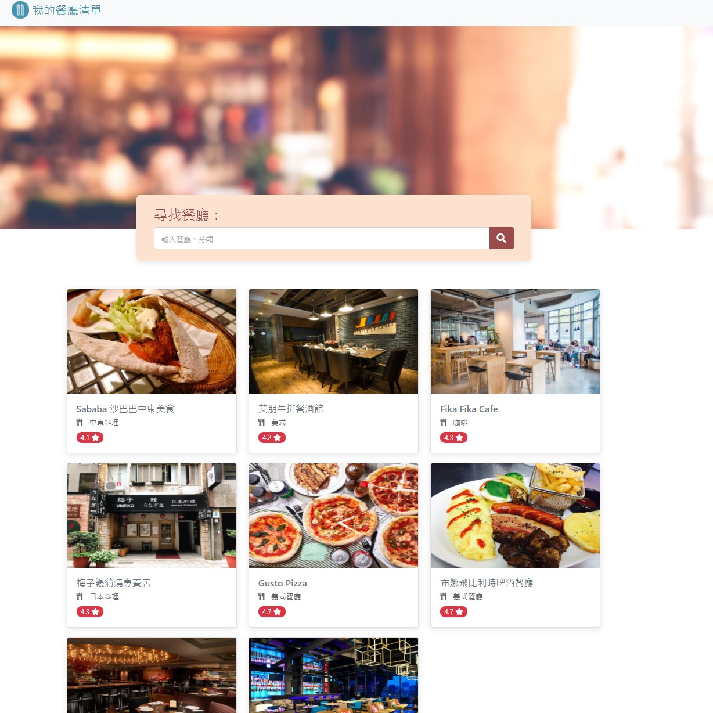

# Restaurant List


## Features
* Present default 8 restaurants.
* Click each card to see more information about this restaurant.
* Search restaurant by name or category in the search bar.

## How to use
1. Use Terminal and clone this project
    ```
    git clone https://github.com/Oscar9023/restaurant_list.git
    ```
2. Cd to `restaurant_list` folder
3. Install npm & nodemon
    ```
    npm install
    ```
4. Run app.js
    ```
    npm run dev
    ```
5. When Terminal show `Express is listening on localhost:3000`, you can use http://localhost:3000/ to enter the website.

## Prerequisites
* npm: 6.14.12
* express: 4.17.1
* express-handlebars: 5.3.3
* nodemon: 2.0.12
* jquery: 3.3.1
* popper: 2.9.1
* bootstrap: 4.6.0
* font-awesome: 5.8.1

