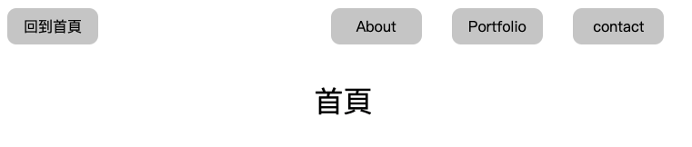
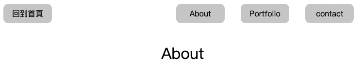
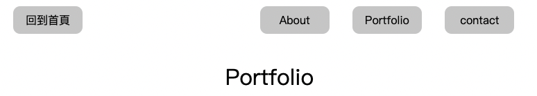
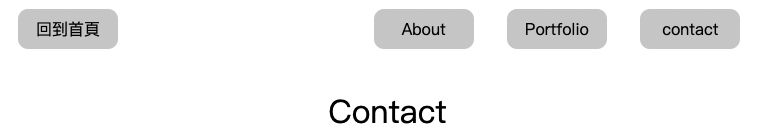

# Test for Express
It's my test for Express manipulation

## Feature
- Users could use the button to the related pages.

### ScreenShots
- Home page

- About page

- Portfolio page

- Contact page

### Prerequisites
1. Node.js
2. nodemon

### Install
1. Open your terminal and use git to clone this project
<pre><code>git clone https://github.com/Beginneraboutlife116/A-web.git</code></pre>
2. Enter the A-web directory
<pre><code>cd A-web</code></pre>
3. Install npm
<pre><code>npm install</code></pre>
4. Use this to run the program
<pre><code>npm run dev</code></pre>
5. You will see `Web is running on http://localhost:3000` on the terminal.
Now, you could use http://localhost:3000 to see the result!!:tada::tada::tada:

### Contributor
- WeiKai